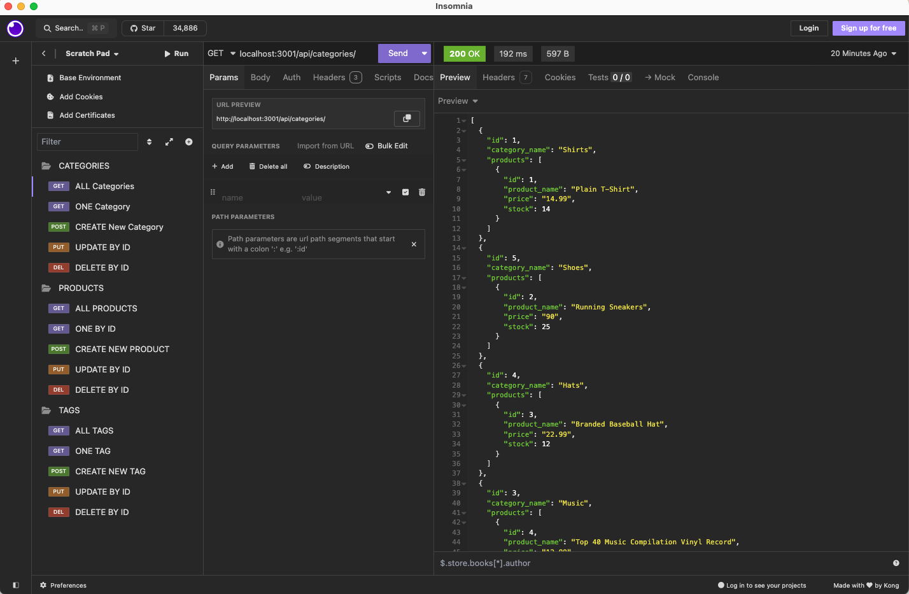
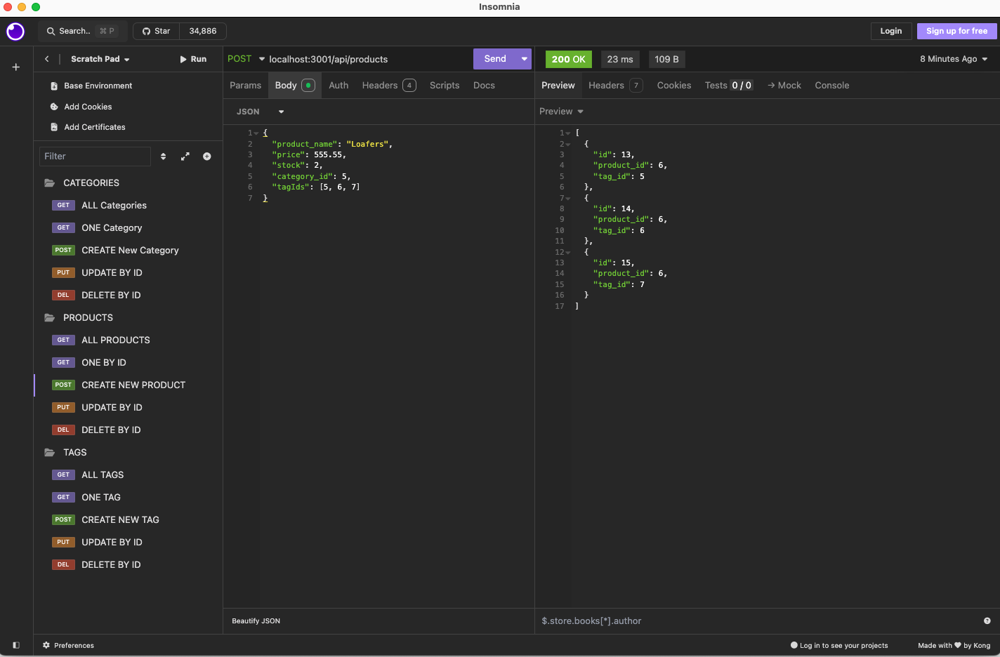

# ORM-back-end 

## Description

This RESTful API allows users to manage a product catalog. Its features include: the ability for users to create, read, update, and delete products. As well as associate them with categories and tags.

## Mock Up

Displaying one of the GET routes.

Displaying one of the POST routes.

## DEMO

<a href="https://drive.google.com/file/d/1e9GHuz6OWJs1Qsap0fSsyIG9gl7RGglq/view?usp=sharing">Link to DEMO video.</a>

## Installation

Clone this [SSH](git@github.com:Kwansom/ORM-back-end.git) key to your local machine. Navigate to the project directory and install necessary dependencies by typing "npm install".

## Usage

In the project directory on the command-line: type "npm start" to start the server.

## Questions

If you have any questions, please contact me at [wansom.kun@gmail.com](mailto:wansom.kun@gmail.com).
You can also find my projects at [GitHub - kwansom](https://github.com/kwansom).
